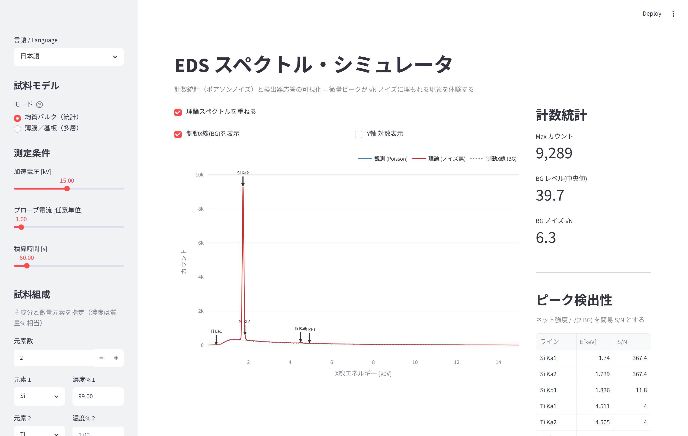

# EDS スペクトル・シミュレータ

[English](README.md) · **日本語**

[](https://edssimulator-xjd8gyxkgdwezujsfevvha.streamlit.app/)
[](LICENSE)
[](https://www.python.org/)
[](https://github.com/yharada520/EDS_simulator/actions/workflows/ci.yml)

SEM-EDS（エネルギー分散型X線分析）の**計数統計（ポアソンノイズ）・検出器応答・薄膜/多層の
マトリクス効果**を、スライダー操作で直感的に理解する教育・R&D 用の Web アプリです。
Streamlit / Plotly / [xraylib](https://github.com/tschoonj/xraylib) 製。

**▶ 公開デモ（インストール不要）: https://edssimulator-xjd8gyxkgdwezujsfevvha.streamlit.app/**

🌐 UI は**日本語と英語**を切り替えられます（サイドバー先頭のセレクタ）。


> まったく同じ試料（Si 99% + 微量 Ti 1%）でも、**測定条件（線量）を変えるだけ**で微量ピークが
> 統計ノイズに埋もれたり出現したりします。左は Max 約2,000カウント、右は約90,000カウント。



---

## このツールの狙い

分析現場では EDS の計数統計や相互作用領域についての誤解が根強く残ります。本ツールは次の2つを
定量的に可視化します。

- **「ピークが見えない＝存在しない」の誤認**: 1% 含有の元素でも、数千カウント程度では
  バックグラウンドの √N ゆらぎに埋もれて見えない。プローブ電流・積算時間を増やせば、組成は
  同じでもピークが出現する。
- **加速電圧の取り過ぎ**: 基板上の極薄膜では情報体積の大半が基板由来。加速電圧を下げると
  φ(ρz) の発生深さが浅くなり、基板シグナルが減って薄膜の S/N が相対的に向上する。

## 機能

- **計数統計**: Kramers 制動X線 ＋ Gaussian 特性ピーク ＋ `numpy.random.poisson` の
  ショットノイズ。Max カウントはプローブ電流×積算時間に線形連動。
- **xraylib データベース**: ライン energy・吸収端・蛍光収率・質量減衰係数（Be 窓/自己吸収）。
  相対強度は**電子衝突電離（Bethe形）×蛍光収率×遷移確率**で、多殻元素（Au の M/L 等）の
  過電圧依存の殻間比を再現。
- **多層薄膜**: 表面から基板まで最大5層。各層・基板は**化学式**（`TiN`, `TiO2`, `Al2O3` 等）で
  指定でき、上層による吸収は Bragg 加算則で計算。解析的 **Packwood-Brown φ(ρz)**（深さスケールは
  **Kanaya-Okayama 電子飛程**に固定）を `scipy.integrate.quad` で深さ積分。
- **2つのモード**: 均質バルク（統計）／薄膜・基板（多層）。
- **日英 UI**: 実行中に日本語⇔英語を切り替え可能。

## 起動方法

### Docker（推奨）

```bash
docker compose up --build
# ブラウザで http://localhost:8501
```

### pip

```bash
pip install -r requirements.txt
streamlit run app.py
```

> `xraylib` は各 OS・Python 3.10〜3.13 の PyPI wheel があり、pip でそのまま入ります。
> 未導入時は内蔵の簡易テーブルにフォールバック（フェーズ1は完全動作、フェーズ2/3は精度限定）。

### conda（任意）

```bash
conda create -n eds-sim python=3.12
conda activate eds-sim
pip install -r requirements.txt
streamlit run app.py
```

## デスクトップアプリ（Windows / macOS）

PyInstaller で **単体実行ファイル**（利用者に Python 不要）に固められます。ローカルで
Streamlit を起動し、ネイティブ窓（pywebview）で表示（無ければ既定ブラウザにフォールバック）。
詳細は [desktop/README.md](desktop/README.md)。

```bash
# 配布したい OS 上でビルド（クロスコンパイル不可）
desktop\build_windows.bat      # Windows → dist\EDS-Simulator\（フォルダごと配布）
bash desktop/build_macos.sh    # macOS   → dist/EDS-Simulator.app
```

> 各 OS で個別にビルド。サイズは numpy/scipy/xraylib 同梱で約 300〜450 MB、Windows は
> フォルダごと配布します。未署名だと初回起動時に SmartScreen / Gatekeeper 警告が出ます。

## 構成例

| 構造 | 層（表面 → 基板） | 何が学べるか |
| --- | --- | --- |
| 密着層付き電極 | `Au` / `Ti` / `Si` | Au の下の Ti 密着層が埋もれて見えにくい |
| 拡散バリア＋自然酸化膜 | `SiO2` / `TiN` / `Si` | 化合物層・自然酸化膜の扱い |
| 表面付着物 | `C` / `O` / `Au` / `Si` | 付着物（軽元素）と Be 窓吸収の関係 |

## ディレクトリ構成

```
EDS_simulator/
├── app.py                 # Streamlit UI・描画
├── i18n.py                # UI 文字列（日本語/英語）
├── eds_sim/               # 物理演算パッケージ
│   ├── config.py          # 定数・データクラス設定
│   ├── continuum.py       # Kramers 制動X線
│   ├── characteristic.py  # 特性X線ライン → Gaussian（バルク／層構造）
│   ├── composition.py     # 化学式パース・化合物密度/質量吸収（Bragg 加算則）
│   ├── detector.py        # 分解能・窓吸収・効率
│   ├── depth.py           # φ(ρz) 深さ分布・薄膜/基板の深さ積分
│   ├── elements.py        # xraylib ヘルパ（遅延import・フォールバック）
│   └── spectrum.py        # 合成 ＋ ポアソンノイズ
├── tests/                 # スモークテスト（pytest）
├── requirements.txt
└── Dockerfile / docker-compose.yml
```

## モデルの前提と限界

- 制動X線は **Kramers 近似**、特性X線は xraylib のラインエネルギー。
- 相対強度は **Bethe 形の電子衝突電離断面積**（∝ ln U / U, U = E0/Ec）× 蛍光収率 × 遷移確率。
  電子線励起 EDS 向けで、光子励起（XRF）の断面積とは異なる。
- 検出器分解能は **Fano 統計の標準式**（Mn Kα 130 eV を基準に較正）、窓吸収は Be 窓の質量減衰。
- **P/B 比・絶対カウントは可視化向けの経験較正**であり第一原理の定量値ではない
  （`peak_to_background`, `intensity_scale`）。
- 薄膜 φ(ρz) は **Packwood-Brown**、深さスケールは **Kanaya-Okayama** 飛程に固定。電子散乱
  マトリクスは基板組成で近似（薄膜 ρz ≪ 飛程）。厚い重元素最上層では電子減速を過小評価しうる。
- 化合物式は**単純式のみ**（括弧なし）。密度はプリセット/単一元素は自動、それ以外は仮の既定値
  （手入力推奨）。

## 今後の予定

- [ ] 括弧・水和物を含む組成式（例: `Ca(OH)2`）
- [ ] 化合物密度プリセットの拡充
- [ ] 吸収端のスペクトル上への可視化
- [ ] 電子衝突電離断面積の高精度化（Casnati / Bote-Salvat）と Coster-Kronig

## テスト

```bash
pip install pytest
pytest tests/ -v
```

## ライセンス

Apache License 2.0 — [LICENSE](LICENSE) と [NOTICE](NOTICE) を参照。

## 引用

研究等で役立った場合は引用いただけると幸いです（[CITATION.cff](CITATION.cff) 参照）。

## 作者

**よっしー (Tohoku Yossy)** — 材料科学者（薄膜合成・表面分析）。
GitHub: [@yharada520](https://github.com/yharada520)
