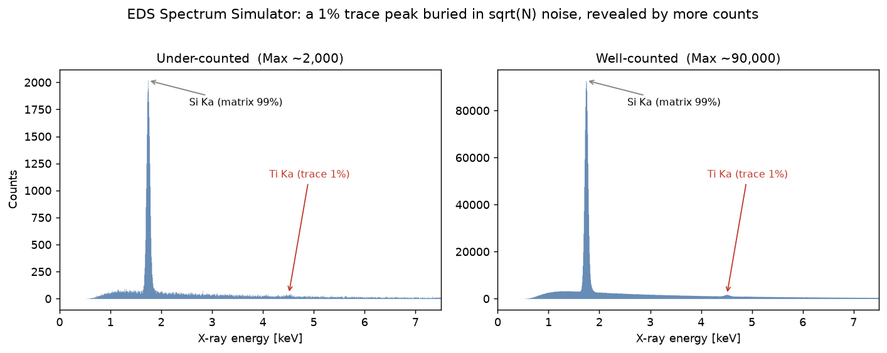
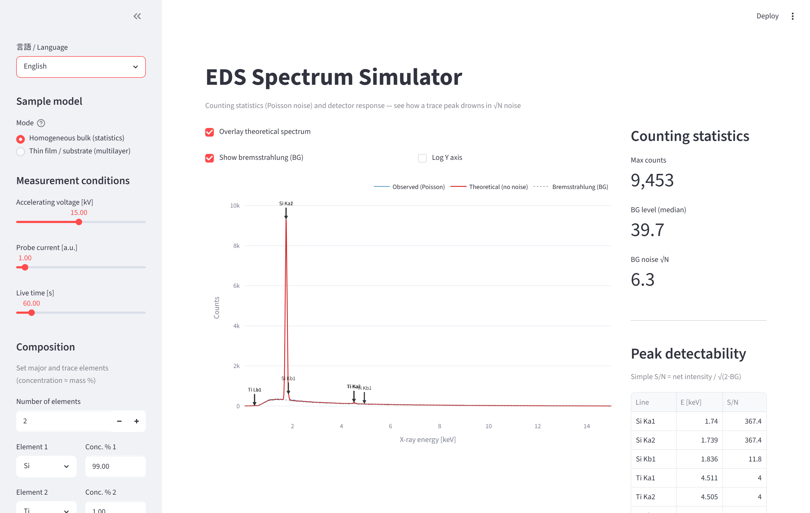

# EDS Spectrum Simulator

**English** · [日本語](README.ja.md)

[](https://edssimulator-xjd8gyxkgdwezujsfevvha.streamlit.app/)
[](LICENSE)
[](https://www.python.org/)
[](https://github.com/yharada520/EDS_simulator/actions/workflows/ci.yml)

An interactive **web app for building intuition about EDS/EDX measurements** — counting
statistics (Poisson noise), detector response, and thin-film / multilayer matrix effects.
Built with Streamlit, Plotly and [xraylib](https://github.com/tschoonj/xraylib).

**▶ Live demo (no install): https://edssimulator-xjd8gyxkgdwezujsfevvha.streamlit.app/**

🌐 The app UI is available in **English and Japanese** (toggle at the top of the sidebar).



> A 1 % trace element (Ti) is invisible in the noise when under-counted (Max ~2,000), but
> emerges once enough counts are collected (Max ~90,000) — the same sample, only the
> measurement condition changed.



---

## Why

Analysts often misread EDS results. Two common failure modes this tool makes tangible:

- **"No peak, so the element is absent."** A 1 % element can be completely buried in the
  √N background noise at a few thousand counts. Increase probe current / live time and it
  appears — with no change in composition.
- **"Higher kV is always better."** For an ALD-thin film on a substrate, most of the
  interaction volume is the substrate. Lowering the accelerating voltage shrinks the
  φ(ρz) generation depth, suppresses the substrate signal, and relatively enhances the
  film S/N.

## Features

- **Counting statistics**: Kramers bremsstrahlung + Gaussian characteristic peaks, with
  `numpy.random.poisson` shot noise. Max counts scales linearly with probe current × live time.
- **xraylib database**: accurate line energies, absorption edges, fluorescence yields, and
  Be-window / self-absorption via mass attenuation coefficients. Line intensities use an
  **electron-impact excitation** model (Bethe ionization × fluorescence yield × radiative
  rate), so multi-shell elements (e.g. Au M vs L) get the right overvoltage-dependent ratios.
- **Multilayer thin film**: stack up to 5 layers (surface → substrate). Each layer/substrate
  is given as a **chemical formula** (e.g. `TiN`, `TiO2`, `Al2O3`); absorption by overlying
  layers is computed with Bragg's additivity rule. Analytical **Packwood-Brown φ(ρz)** depth
  distribution anchored to the **Kanaya-Okayama** electron range, integrated with
  `scipy.integrate.quad`.
- **Two modes**: *homogeneous bulk (statistics)* and *thin film / substrate (multilayer)*.
- **Bilingual UI**: switch between English and Japanese at runtime.

## Quick start

### Docker (recommended)

```bash
docker compose up --build
# open http://localhost:8501
```

### pip

```bash
pip install -r requirements.txt
streamlit run app.py
```

> `xraylib` ships PyPI wheels for every OS and Python 3.10–3.13, so pip installs it directly.
> Without it, the app falls back to a small built-in table (Phase 1 fully works, Phase 2/3
> accuracy limited).

### conda (optional)

```bash
conda create -n eds-sim python=3.12
conda activate eds-sim
pip install -r requirements.txt
streamlit run app.py
```

## Desktop app (Windows / macOS)

Package the app as a **standalone executable** (no Python needed by the user) with
PyInstaller. The launcher starts a local Streamlit server and shows it in a native window
(pywebview), falling back to the default browser. Details: [desktop/README.md](desktop/README.md).

```bash
# Build on the target OS (no cross-compilation)
desktop\build_windows.bat      # Windows -> dist\EDS-Simulator\  (distribute the whole folder)
bash desktop/build_macos.sh    # macOS   -> dist/EDS-Simulator.app
```

> Build separately on each OS. The bundle is ~300–450 MB (numpy/scipy/xraylib) and is shipped
> as a folder on Windows. Unsigned builds trigger a SmartScreen / Gatekeeper warning on first
> launch.

## Example structures

| Structure | Layers (surface → substrate) | What it shows |
| --- | --- | --- |
| Electrode with adhesion layer | `Au` / `Ti` / `Si` | The Ti adhesion layer under Au is hard to see |
| Diffusion barrier + native oxide | `SiO2` / `TiN` / `Si` | Compound layers and a native oxide |
| Surface contamination | `C` / `O` / `Au` / `Si` | Light-element deposits vs Be-window absorption |

## Project layout

```
EDS_simulator/
├── app.py                 # Streamlit UI / plotting
├── i18n.py                # UI strings (English / Japanese)
├── eds_sim/               # physics package
│   ├── config.py          # constants / dataclasses
│   ├── continuum.py       # Kramers bremsstrahlung
│   ├── characteristic.py  # characteristic lines -> Gaussians (bulk / layered)
│   ├── composition.py     # formula parsing, compound density / MAC (Bragg)
│   ├── detector.py        # resolution, window absorption, efficiency
│   ├── depth.py           # phi(rho z) and thin-film / substrate depth integrals
│   ├── elements.py        # xraylib helpers (lazy import, fallback)
│   └── spectrum.py        # assembly + Poisson noise
├── tests/                 # smoke tests (pytest)
├── requirements.txt
└── Dockerfile / docker-compose.yml
```

## Model assumptions & limitations

- Bremsstrahlung uses the **Kramers** approximation; characteristic lines use xraylib line
  energies.
- Line intensities use a **Bethe electron-impact ionization** cross-section (∝ ln U / U,
  U = E0/Ec) × fluorescence yield × radiative rate — appropriate for electron-beam EDS, not
  the photon-excited (XRF) cross-sections.
- Detector resolution follows the standard **Fano-statistics** formula (calibrated to 130 eV
  at Mn Kα); window absorption is the Be-window mass attenuation.
- **Peak-to-background ratio and absolute counts are an empirical calibration** for
  visualization, not first-principles quantitative values (`peak_to_background`,
  `intensity_scale`).
- The thin-film φ(ρz) is **Packwood-Brown** with a **Kanaya-Okayama** depth scale; the
  electron-scattering matrix is approximated by the substrate composition (thin films,
  ρz ≪ range), so a thick heavy top layer underestimates electron slowing-down.
- Compound formulas support **simple formulas only** (no parentheses). Density comes from a
  preset table / single-element values, otherwise a nominal default (manual entry recommended).

## Roadmap

- [ ] Parenthetical / hydrate formulas (e.g. `Ca(OH)2`).
- [ ] Expand the compound-density preset table.
- [ ] Absorption-edge visualization on the spectrum.
- [ ] Refined electron-impact cross-sections (Casnati / Bote-Salvat) and Coster-Kronig.

## Tests

```bash
pip install pytest
pytest tests/ -v
```

## License

Apache License 2.0 — see [LICENSE](LICENSE) and [NOTICE](NOTICE).

## Citation

If this tool is useful in your work, please cite it (see [CITATION.cff](CITATION.cff)).

## Author

**Yossy (Tohoku Yossy)** — materials scientist (thin-film synthesis, surface analysis).
GitHub: [@yharada520](https://github.com/yharada520)
